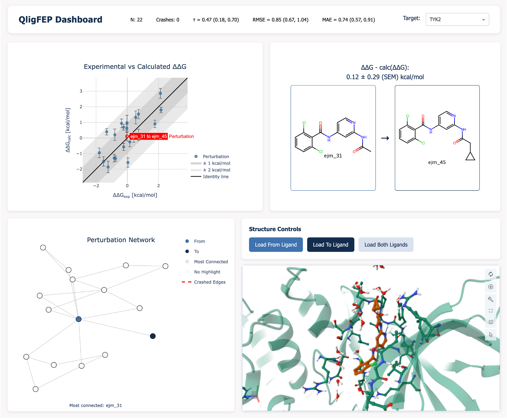

# QligFEPv2 Benchmarking Experiments

This repository contains the benchmarking experiments for **QligFEPv2**, an iteration on the development of the QligFEP software for relative binding free energy (RBFE) calculations. QligFEP is a Python-based tool that automates the setup, execution, and analysis of free energy perturbation (FEP) calculations using the [Q simulation package](https://github.com/qusers/Q6).

**Original QligFEP publication:** Jespers, W., Esguerra, M., Åqvist, J., Gutiérrez-de-Terán, H., QligFEP: an automated workflow for small molecule free energy calculations in Q. *J Cheminform* **11**, 26 (2019). https://doi.org/10.1186/s13321-019-0348-5

> 📄 *Manuscript describing this work is coming soon.*

## Overview

This benchmarking study evaluates QligFEPv2 performance across **16 protein-ligand systems** from two established datasets:
- **JACS Benchmark Set** (8 targets): BACE1, CDK2, JNK1, MCL1, P38, PTP1B, Thrombin, TYK2
- **Merck Public Dataset** (8 targets): CDK8, cMET, EG5, HIF-2α, PFKFB3, SHP2, SYK, TNKS2

The repository provides:
- Starting structures and preparation workflows
- Complete FEP setup and analysis scripts
- Interactive visualization dashboard
- Comprehensive performance analysis notebooks
- Detailed performance metrics and regression plots

## Interactive Dashboard

Explore the benchmarking results through an interactive Dash web application that visualizes perturbation networks, molecular structures, and performance metrics for each target.

<div align="center">
  
</div>

### Running the Dashboard

Install dependencies:
```bash
python -m pip install git+https://github.com/David-Araripe/SFC_FreeEnergyCorrection.git \
    git+https://github.com/David-Araripe/Weighted_cc.git \
    git+https://github.com/David-Araripe/chemFilters.git \
    dash cinnabar dash-molstar dash-bootstrap-components \
    statannotations statsmodels fastparquet tabulate pyfonts
```

Launch the dashboard:
```bash
python app.py
```

The dashboard provides:
- Interactive perturbation network graphs
- 3D molecular visualization using Molstar ([everburstSun/dash-molstar](https://github.com/everburstSun/dash-molstar))
- Experimental vs. calculated ΔΔG regression plots
- Statistical performance metrics (RMSE, MUE, Kendall's τ)

## Repository Structure

```
├── perturbations/          # Input structures and FEP setup files
│   └── <target>/
│       ├── protein.pdb     # Prepared protein structure
│       ├── water.pdb       # Equilibrated water sphere
│       ├── ligands.sdf     # All ligands for the target
│       ├── mapping.json    # Perturbation network definition
│       ├── <ligand>.lib    # Q library files (force field parameters)
│       ├── <ligand>.prm    # Q parameter files
│       ├── <ligand>.pdb    # Individual ligand structures
│       ├── prepare.sh      # SLURM script to setup FEP calculations
│       └── analyze.sh      # SLURM script to analyze results
│
├── results/                # Analyzed FEP results
│   └── <target>/
│       ├── <target>_FEP_results.json         # Raw FEP energies
│       ├── <target>_dgBar_verbose.parquet    # Verbose output from qfep
│       ├── <target>_run_data.parquet         # Runtime data (all replicates)
│       └── mapping_ddG.json                  # Network with calculated ΔΔG
│
├── startFiles/             # Raw inputs, data preparation notebooks
├── figures/                # Figures for manuscript
├── cache/                  # Cached processed data for dashboard
├── app.py                  # Interactive Dash visualization dashboard
└── results_check.ipynb     # Main analysis notebook with all metrics
```

## Data Source and Preparation

The starting structures are derived from the [IndustryBenchmarks2024](https://github.com/OpenFreeEnergy/IndustryBenchmarks2024) repository ([Zenodo](https://zenodo.org/records/17245550)), with specific modifications detailed in [`PROT_PREPARATION.md`](PROT_PREPARATION.md).

### Preparation Workflow Notebooks

The `startFiles/` directory contains Jupyter notebooks documenting the complete preparation workflow:

| Notebook | Description |
|----------|-------------|
| [`extract_data.ipynb`](startFiles/extract_data.ipynb) | Downloads structures from IndustryBenchmarks2024 repository |
| [`ligand_alignment.ipynb`](startFiles/ligand_alignment.ipynb) | Aligns ligand structures to reference conformations |
| [`rename_and_prepare_pdbs.ipynb`](startFiles/rename_and_prepare_pdbs.ipynb) | Standardizes atom naming and generates water spheres with `qprep` |
| [`perturbation_mapping.ipynb`](startFiles/perturbation_mapping.ipynb) | Creates perturbation network mappings using automatic algorithms |
| [`restraint_check.ipynb`](startFiles/restraint_check.ipynb) | Validates restraint selection for each perturbation |
| [`system_sizes_and_total_compute.ipynb`](startFiles/system_sizes_and_total_compute.ipynb) | Analyzes system sizes and computational requirements |

## Running FEP Calculations

### Setup
Navigate to a target directory and run the preparation script:
```bash
cd perturbations/<target>
sbatch prepare.sh  # or run setupFEP command directly
```

The `prepare.sh` script:
1. Splits the multi-molecule SDF file into individual ligand files
2. Runs `setupFEP` to generate FEP input files with appropriate restraints

### Analysis
After simulations complete, analyze results:
```bash
cd perturbations/<target>
sbatch analyze.sh  # or run qligfep_analyze command directly
```

The `analyze.sh` script runs `qligfep_analyze` to:
1. Process FEP trajectories using the Gbar estimator
2. Calculate ΔΔG values with statistical uncertainties
3. Generate detailed results in parquet and JSON formats
4. Move results to the appropriate directory

**Note:** Target-specific setup commands with restraint strategies are documented in [`perturbations/commands.md`](perturbations/commands.md).

## Performance Results

Comprehensive performance metrics and analysis are available in:

- **[`results/README.md`](results/README.md)** - Performance tables for ΔΔG and ΔG predictions across all targets, including:
  - Kendall's τ (correlation coefficient)
  - RMSE (root mean square error)
  - MUE (mean unsigned error)
  - Regression plots for each target

- **[`results_check.ipynb`](results_check.ipynb)** - Interactive analysis notebook containing:
  - Detailed statistical comparisons across force fields (QligFEP, OPLS3e, PMX-Sage 2.0)
  - Stripplots and stacked metrics visualizations
  - Computational performance analysis
  - System size distributions

## Citation

If you use this data or code, please cite:

- **QligFEP original paper**: Jespers, W., Esguerra, M., Åqvist, J., Gutiérrez-de-Terán, H., QligFEP: an automated workflow for small molecule free energy calculations in Q. *J Cheminform* **11**, 26 (2019). https://doi.org/10.1186/s13321-019-0348-5

- **IndustryBenchmarks2024**: Baumann H., Alibay I., Horton J., Ries B., Henry M., *et al.*, OpenFreeEnergy/IndustryBenchmarks2024: v1.0.0 (v1.0.0). Zenodo. (2025) https://doi.org/10.5281/zenodo.17245550

- **Manuscript for this work**: *Coming soon*

## License

See [LICENSE](LICENSE) file for details.

## Contact

For questions about this benchmarking study or QligFEPv2, please open an issue in this repository.
