# Results

This directory contains the results from the perturbations that were ran during this project.

The input files to reproduce these results can be found in the [perturbations](../perturbations/) directory. The respective commands to create the FEP inputs and slurm submission scripts and to analyzed the obtained results can be found in the [commands.md](../perturbations/commands.md) file, in the same directory.

# $\Delta\Delta G$ Performance metrics:

|          | ('KTAU', 'OPLS3e')    | ('KTAU', 'PMX-Sage 2.0')   | ('KTAU', 'QligFEP')   | ('RMSE', 'OPLS3e')   | ('RMSE', 'PMX-Sage 2.0')   | ('RMSE', 'QligFEP')   | ('MUE', 'OPLS3e')    | ('MUE', 'PMX-Sage 2.0')   | ('MUE', 'QligFEP')   |   ('N', 'OPLS3e') |   ('N', 'PMX-Sage 2.0') |   ('N', 'QligFEP') |
|:---------|:----------------------|:---------------------------|:----------------------|:---------------------|:---------------------------|:----------------------|:---------------------|:--------------------------|:---------------------|------------------:|------------------------:|-------------------:|
| bace     | $0.32_{0.16}^{0.48}$  | $0.3_{0.12}^{0.47}$        | $0.37_{0.18}^{0.55}$  | $1.61_{1.31}^{1.91}$ | $1.1_{0.92}^{1.28}$        | $1.7_{1.35}^{2.05}$   | $1.26_{1.01}^{1.52}$ | $0.88_{0.71}^{1.05}$      | $1.28_{0.99}^{1.59}$ |                58 |                      58 |                 49 |
| cdk2     | $0.59_{0.37}^{0.8}$   | $0.46_{0.22}^{0.7}$        | $0.52_{0.18}^{0.77}$  | $1.38_{0.59}^{2.14}$ | $1.17_{0.9}^{1.41}$        | $1.49_{1.07}^{1.87}$  | $0.8_{0.45}^{1.29}$  | $0.99_{0.77}^{1.23}$      | $1.17_{0.8}^{1.57}$  |                25 |                      25 |                 22 |
| cdk8     | $0.53_{0.4}^{0.66}$   | $0.53_{0.37}^{0.66}$       | $0.4_{0.23}^{0.56}$   | $1.56_{1.29}^{1.84}$ | $1.57_{1.31}^{1.83}$       | $1.99_{1.6}^{2.37}$   | $1.22_{0.98}^{1.5}$  | $1.26_{1.02}^{1.53}$      | $1.58_{1.27}^{1.93}$ |                54 |                      54 |                 55 |
| cmet     | $0.6_{0.49}^{0.71}$   | $0.53_{0.34}^{0.68}$       | $0.42_{0.2}^{0.62}$   | $1.38_{1.12}^{1.68}$ | $2.24_{1.28}^{3.29}$       | $3.21_{1.48}^{4.87}$  | $1.09_{0.87}^{1.32}$ | $1.39_{1.01}^{1.92}$      | $1.86_{1.08}^{2.91}$ |                57 |                      57 |                 34 |
| eg5      | $0.42_{0.29}^{0.54}$  | $0.36_{0.21}^{0.5}$        | $0.24_{0.01}^{0.43}$  | $1.35_{1.09}^{1.59}$ | $1.16_{0.95}^{1.36}$       | $2.5_{1.58}^{3.55}$   | $1.0_{0.79}^{1.22}$  | $0.95_{0.79}^{1.12}$      | $1.77_{1.27}^{2.42}$ |                65 |                      65 |                 38 |
| hif2a    | $0.44_{0.29}^{0.56}$  | $0.38_{0.25}^{0.49}$       | $0.3_{0.1}^{0.46}$    | $1.53_{1.25}^{1.85}$ | $2.32_{1.99}^{2.65}$       | $2.13_{1.74}^{2.51}$  | $1.17_{0.96}^{1.39}$ | $1.8_{1.52}^{2.1}$        | $1.68_{1.35}^{2.03}$ |                80 |                      92 |                 57 |
| jnk1     | $0.51_{0.29}^{0.68}$  | $0.4_{0.13}^{0.63}$        | $0.35_{0.07}^{0.61}$  | $0.68_{0.55}^{0.79}$ | $1.09_{0.75}^{1.4}$        | $0.86_{0.59}^{1.15}$  | $0.58_{0.45}^{0.7}$  | $0.8_{0.55}^{1.07}$       | $0.66_{0.46}^{0.9}$  |                31 |                      31 |                 27 |
| mcl1     | $0.24_{0.1}^{0.38}$   | $0.21_{0.07}^{0.36}$       | $0.14_{-0.04}^{0.32}$ | $1.4_{1.21}^{1.58}$  | $1.61_{1.35}^{1.89}$       | $2.03_{1.61}^{2.46}$  | $1.18_{1.01}^{1.35}$ | $1.3_{1.09}^{1.53}$       | $1.62_{1.33}^{1.94}$ |                71 |                      71 |                 60 |
| p38      | $0.62_{0.48}^{0.73}$  | $0.59_{0.46}^{0.71}$       | $0.54_{0.41}^{0.64}$  | $1.0_{0.77}^{1.2}$   | $1.09_{0.79}^{1.41}$       | $1.49_{1.07}^{1.97}$  | $0.77_{0.59}^{0.94}$ | $0.77_{0.57}^{0.98}$      | $1.13_{0.88}^{1.42}$ |                56 |                      56 |                 51 |
| pfkfb3   | $0.64_{0.53}^{0.73}$  | $0.52_{0.37}^{0.64}$       | $0.33_{0.13}^{0.52}$  | $1.37_{1.1}^{1.63}$  | $1.53_{1.23}^{1.83}$       | $1.68_{1.25}^{2.12}$  | $1.07_{0.87}^{1.29}$ | $1.2_{0.96}^{1.46}$       | $1.29_{1.0}^{1.62}$  |                66 |                      66 |                 48 |
| ptp1b    | $0.74_{0.62}^{0.84}$  | $0.21_{-0.01}^{0.42}$      | $0.34_{0.05}^{0.61}$  | $0.8_{0.68}^{0.9}$   | $2.18_{1.58}^{2.69}$       | $2.75_{1.91}^{3.48}$  | $0.67_{0.55}^{0.78}$ | $1.55_{1.16}^{1.95}$      | $1.98_{1.33}^{2.67}$ |                49 |                      49 |                 33 |
| shp2     | $0.41_{0.22}^{0.56}$  | $0.22_{0.03}^{0.39}$       | $0.46_{0.28}^{0.61}$  | $1.39_{1.09}^{1.73}$ | $2.63_{2.06}^{3.21}$       | $3.08_{2.27}^{3.86}$  | $1.06_{0.83}^{1.31}$ | $2.02_{1.6}^{2.48}$       | $2.34_{1.71}^{3.03}$ |                56 |                      56 |                 37 |
| syk      | $0.22_{0.07}^{0.36}$  | $0.33_{0.19}^{0.46}$       | $0.42_{0.25}^{0.57}$  | $1.27_{1.1}^{1.44}$  | $1.44_{1.17}^{1.71}$       | $1.4_{1.08}^{1.73}$   | $1.02_{0.87}^{1.16}$ | $1.04_{0.85}^{1.24}$      | $1.09_{0.87}^{1.33}$ |               101 |                     101 |                 59 |
| thrombin | $0.34_{-0.02}^{0.64}$ | $0.22_{-0.23}^{0.6}$       | $0.38_{-0.06}^{0.75}$ | $1.33_{0.87}^{1.74}$ | $1.31_{1.05}^{1.54}$       | $1.37_{0.73}^{1.92}$  | $1.08_{0.72}^{1.51}$ | $1.15_{0.85}^{1.44}$      | $1.03_{0.57}^{1.54}$ |                16 |                      16 |                 14 |
| tnks2    | $0.41_{0.23}^{0.57}$  | $0.5_{0.35}^{0.64}$        | $0.3_{0.05}^{0.52}$   | $1.21_{0.93}^{1.5}$  | $0.89_{0.71}^{1.05}$       | $1.22_{0.97}^{1.44}$  | $0.89_{0.71}^{1.1}$  | $0.68_{0.54}^{0.82}$      | $1.03_{0.81}^{1.26}$ |                60 |                      60 |                 33 |
| tyk2     | $0.57_{0.33}^{0.76}$  | $0.51_{0.27}^{0.72}$       | $0.47_{0.16}^{0.69}$  | $0.94_{0.71}^{1.17}$ | $1.16_{0.86}^{1.47}$       | $0.85_{0.66}^{1.05}$  | $0.76_{0.57}^{1.0}$  | $0.96_{0.73}^{1.25}$      | $0.74_{0.57}^{0.93}$ |                24 |                      24 |                 22 |

# $\Delta G$ Performance metrics:

|          | ('KTAU', 'OPLS3e')    | ('KTAU', 'PMX-Sage 2.0')   | ('KTAU', 'QligFEP')   | ('RMSE', 'OPLS3e')   | ('RMSE', 'PMX-Sage 2.0')   | ('RMSE', 'QligFEP')   | ('MUE', 'OPLS3e')    | ('MUE', 'PMX-Sage 2.0')   | ('MUE', 'QligFEP')   |   ('N', 'OPLS3e') |   ('N', 'PMX-Sage 2.0') |   ('N', 'QligFEP') |
|:---------|:----------------------|:---------------------------|:----------------------|:---------------------|:---------------------------|:----------------------|:---------------------|:--------------------------|:---------------------|------------------:|------------------------:|-------------------:|
| bace     | $0.45_{0.22}^{0.64}$  | $0.49_{0.3}^{0.65}$        | $0.27_{0.06}^{0.48}$  | $1.67_{1.32}^{2.04}$ | $1.42_{1.21}^{1.61}$       | $1.76_{1.4}^{2.08}$   | $1.4_{1.1}^{1.73}$   | $1.21_{0.99}^{1.43}$      | $1.42_{1.11}^{1.75}$ |                36 |                      36 |                 36 |
| cdk2     | $0.44_{0.11}^{0.72}$  | $0.56_{0.25}^{0.81}$       | $0.57_{0.32}^{0.8}$   | $0.91_{0.58}^{1.2}$  | $0.8_{0.58}^{1.02}$        | $1.59_{0.99}^{2.17}$  | $0.69_{0.41}^{1.0}$  | $0.66_{0.45}^{0.9}$       | $1.16_{0.66}^{1.72}$ |                16 |                      16 |                 16 |
| cdk8     | $0.57_{0.38}^{0.75}$  | $0.6_{0.46}^{0.72}$        | $0.57_{0.37}^{0.75}$  | $1.46_{1.05}^{1.82}$ | $1.1_{0.92}^{1.27}$        | $2.48_{2.02}^{2.94}$  | $1.19_{0.9}^{1.5}$   | $0.95_{0.76}^{1.14}$      | $2.08_{1.63}^{2.56}$ |                33 |                      33 |                 32 |
| cmet     | $0.73_{0.56}^{0.85}$  | $0.69_{0.4}^{0.89}$        | $0.67_{0.48}^{0.82}$  | $1.56_{1.17}^{1.85}$ | $1.82_{1.22}^{2.52}$       | $4.23_{2.96}^{5.3}$   | $1.28_{0.88}^{1.63}$ | $1.4_{1.01}^{1.91}$       | $3.08_{1.95}^{4.27}$ |                24 |                      24 |                 24 |
| eg5      | $0.54_{0.37}^{0.71}$  | $0.47_{0.24}^{0.67}$       | $0.33_{0.09}^{0.55}$  | $2.65_{2.35}^{2.91}$ | $0.76_{0.57}^{0.91}$       | $1.77_{1.28}^{2.19}$  | $2.5_{2.18}^{2.81}$  | $0.59_{0.42}^{0.77}$      | $1.37_{0.98}^{1.79}$ |                28 |                      28 |                 27 |
| hif2a    | $0.45_{0.2}^{0.63}$   | $0.36_{0.16}^{0.53}$       | $0.38_{0.22}^{0.55}$  | $1.13_{0.79}^{1.53}$ | $1.64_{1.28}^{1.96}$       | $2.41_{1.96}^{2.88}$  | $0.85_{0.65}^{1.1}$  | $1.23_{0.92}^{1.57}$      | $1.97_{1.56}^{2.44}$ |                42 |                      42 |                 41 |
| jnk1     | $0.72_{0.53}^{0.87}$  | $0.68_{0.51}^{0.84}$       | $0.56_{0.29}^{0.77}$  | $0.64_{0.48}^{0.78}$ | $1.33_{0.94}^{1.61}$       | $1.41_{1.04}^{1.79}$  | $0.53_{0.38}^{0.69}$ | $1.05_{0.7}^{1.38}$       | $1.14_{0.81}^{1.51}$ |                21 |                      21 |                 21 |
| mcl1     | $0.42_{0.24}^{0.6}$   | $0.47_{0.28}^{0.62}$       | $0.47_{0.29}^{0.62}$  | $1.37_{1.1}^{1.6}$   | $1.43_{1.18}^{1.65}$       | $2.01_{1.51}^{2.52}$  | $1.1_{0.86}^{1.34}$  | $1.15_{0.9}^{1.4}$        | $1.57_{1.21}^{1.99}$ |                42 |                      42 |                 42 |
| p38      | $0.64_{0.46}^{0.8}$   | $0.48_{0.28}^{0.66}$       | $0.51_{0.32}^{0.66}$  | $0.81_{0.6}^{1.0}$   | $0.99_{0.71}^{1.28}$       | $1.62_{1.02}^{2.21}$  | $0.63_{0.46}^{0.81}$ | $0.73_{0.52}^{0.97}$      | $1.14_{0.79}^{1.54}$ |                34 |                      34 |                 34 |
| pfkfb3   | $0.6_{0.47}^{0.71}$   | $0.47_{0.31}^{0.61}$       | $0.55_{0.38}^{0.69}$  | $1.32_{1.08}^{1.53}$ | $1.35_{1.01}^{1.62}$       | $1.96_{1.5}^{2.41}$   | $1.08_{0.85}^{1.31}$ | $1.02_{0.74}^{1.28}$      | $1.5_{1.13}^{1.9}$   |                40 |                      40 |                 38 |
| ptp1b    | $0.77_{0.59}^{0.9}$   | $0.3_{-0.07}^{0.61}$       | $0.42_{0.09}^{0.65}$  | $0.68_{0.45}^{0.89}$ | $1.2_{0.7}^{1.65}$         | $2.7_{1.82}^{3.45}$   | $0.51_{0.34}^{0.71}$ | $0.86_{0.55}^{1.22}$      | $2.07_{1.38}^{2.72}$ |                23 |                      23 |                 23 |
| shp2     | $0.55_{0.34}^{0.73}$  | $0.12_{-0.23}^{0.46}$      | $0.54_{0.37}^{0.7}$   | $1.02_{0.72}^{1.3}$  | $1.98_{1.52}^{2.38}$       | $3.62_{2.2}^{4.89}$   | $0.79_{0.55}^{1.05}$ | $1.58_{1.1}^{2.05}$       | $2.49_{1.57}^{3.54}$ |                26 |                      26 |                 26 |
| syk      | $0.29_{0.07}^{0.5}$   | $0.39_{0.18}^{0.58}$       | $0.41_{0.19}^{0.6}$   | $1.41_{1.13}^{1.68}$ | $1.71_{1.31}^{2.06}$       | $1.29_{0.95}^{1.66}$  | $1.17_{0.94}^{1.4}$  | $1.3_{0.97}^{1.64}$       | $0.94_{0.71}^{1.21}$ |                44 |                      44 |                 44 |
| thrombin | $0.56_{0.1}^{0.88}$   | $0.45_{0.02}^{0.84}$       | $0.45_{0.08}^{0.76}$  | $0.74_{0.46}^{1.01}$ | $1.26_{0.77}^{1.68}$       | $1.2_{0.53}^{1.77}$   | $0.58_{0.33}^{0.88}$ | $1.04_{0.63}^{1.47}$      | $0.89_{0.44}^{1.46}$ |                11 |                      11 |                 11 |
| tnks2    | $0.29_{-0.01}^{0.54}$ | $0.34_{0.04}^{0.57}$       | $0.02_{-0.25}^{0.3}$  | $1.74_{1.16}^{2.19}$ | $1.06_{0.76}^{1.31}$       | $1.95_{1.43}^{2.4}$   | $1.27_{0.83}^{1.73}$ | $0.83_{0.6}^{1.08}$       | $1.55_{1.1}^{2.02}$  |                27 |                      27 |                 27 |
| tyk2     | $0.73_{0.45}^{0.95}$  | $0.63_{0.34}^{0.85}$       | $0.63_{0.33}^{0.86}$  | $0.68_{0.53}^{0.82}$ | $0.99_{0.71}^{1.26}$       | $0.63_{0.46}^{0.78}$  | $0.62_{0.48}^{0.76}$ | $0.83_{0.57}^{1.1}$       | $0.53_{0.36}^{0.69}$ |                16 |                      16 |                 16 |

# Regression plots

## JACS dataset

### bace

  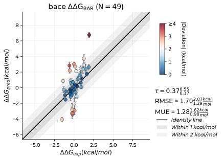

### cdk2

  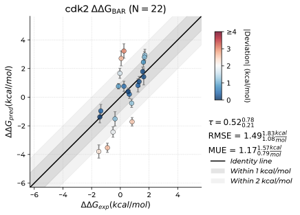

### jnk1

  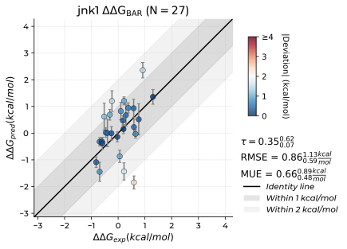

### mcl1

  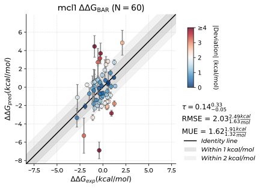

### p38

  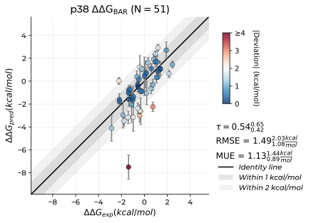

### ptp1b

  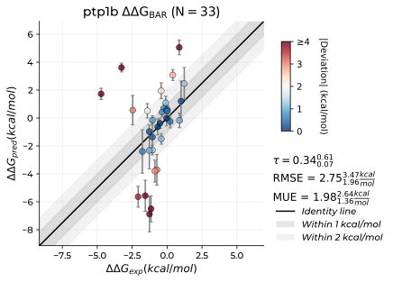

### thrombin

  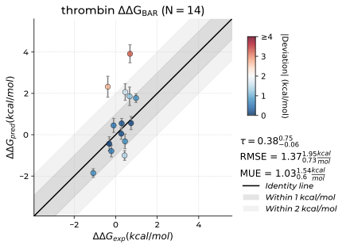

### tyk2

  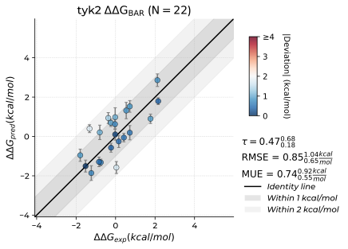

### cdk8

For cdk8, we have performances with the automatic perturbation mapping approach, and with the manually designed mapping.

Automatic mapping:

  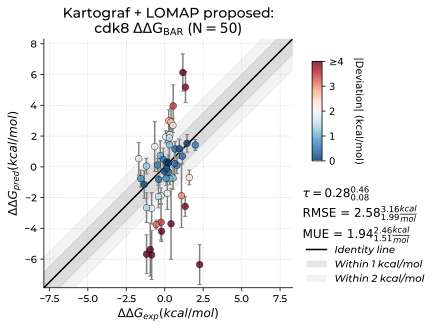

Manual mapping:

    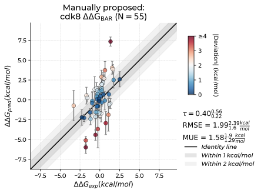

### cmet

  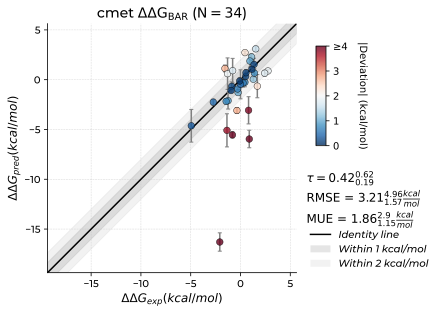

### eg5

  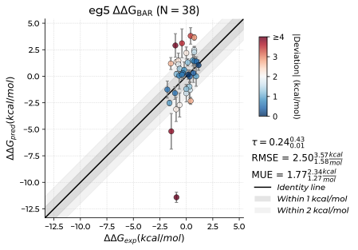

### hif2a

  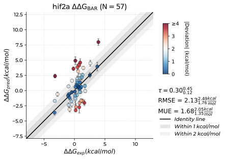

### shp2

  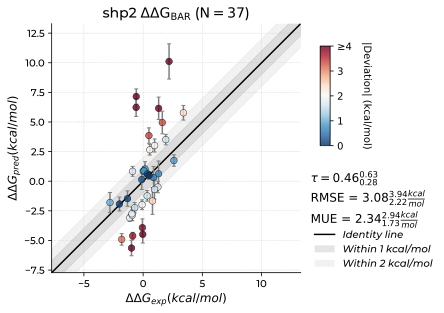

### syk

  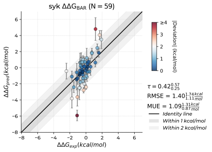

### pfkfb3

  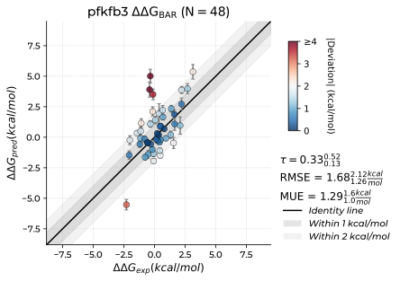

### tnks2

  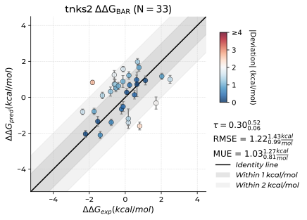

